# tscalectl CLI
Add AWS EC2 instances into your tailscale network (tailnet).
Provides easy SSH access to your instances.
Afterwards, delete EC2 instance and associated resources with a single command.

# Installation

`go install github.com/svennjegac/tailscale.node-provider/tscalectl@latest`

# Prerequisites
1. Generate `Reusable` & `Ephemeral` Tailscale Auth key. (https://login.tailscale.com/admin/settings/keys) 
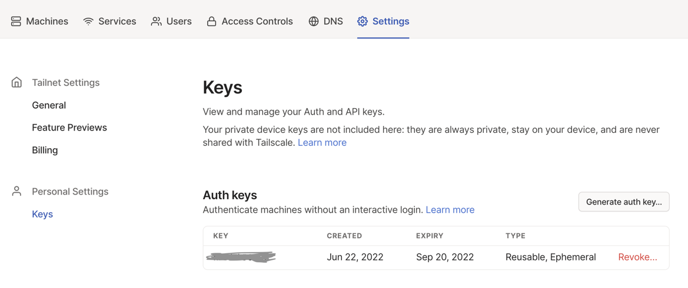
2. Generate AWS access key and secret. Give admin permissions to keys. It is possible to restrict access, but I did not take time yet to define proper IAM policy document. (https://aws.amazon.com/premiumsupport/knowledge-center/create-access-key/) 
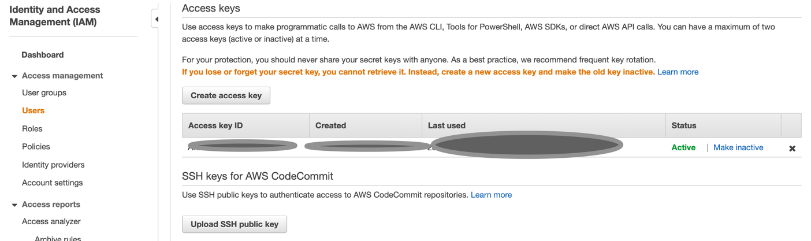
3. Add `autoApprovers` to your Tailscale ACL configuration. (Normally, when you advertise EC2 instance as exit node, you will need to manually approve it through UI. This ACL rule automates approving step) 
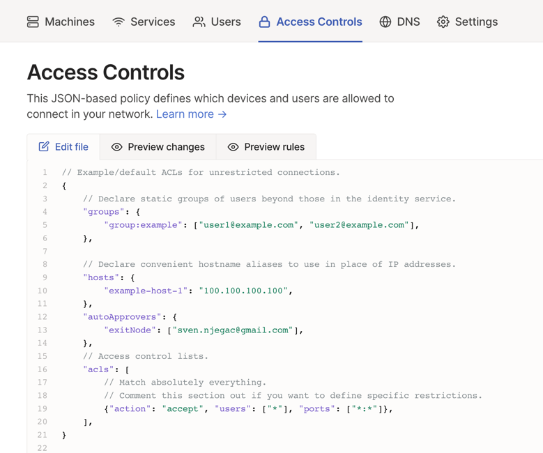
4. You will be prompted to enter credentials when invoking commands which communicate with AWS / Tailscale.
   (We will get to that in the next section)

# Usage

## tscalectl up -i -e [flags]
Add AWS EC2 instance into your tailnet.

1. Run `tscalectl up -i -e` (`interactive` & `exit-node` flags turned ON).
2. Enter credentials which were created in the `Prerequsites` section. (AWS creds + Tailscale auth key) 
3. Interactive flag will prompt you to provide region, instanceType and instance AMI. Enter the number which indicates chosen region. (And do the same for instanceType and AMI). 
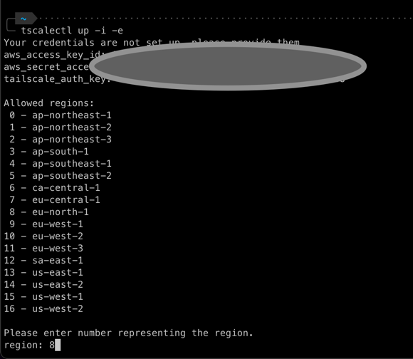
4. Afterwards, CLI will proceed with VPN node provisioning. 
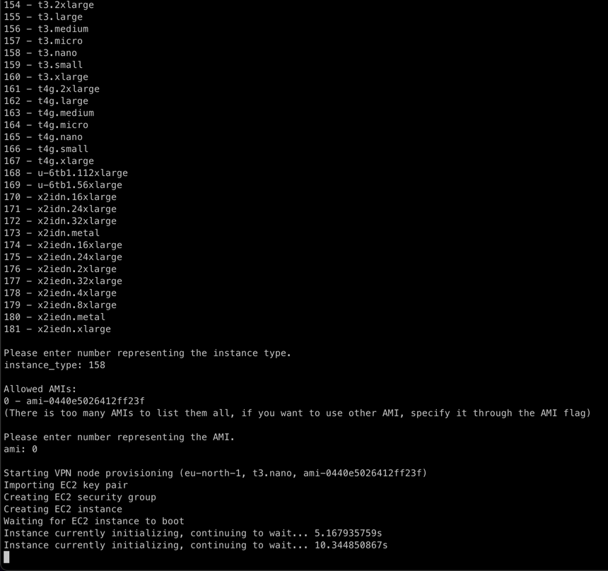
5. Once done, CLI will inform you that your node is ready for use. 
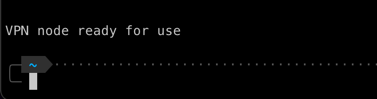
6. You will be able to see and use your tailscale nodes. 
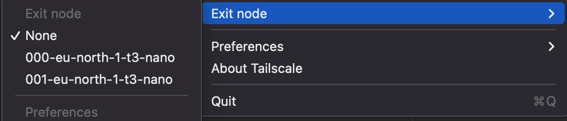

## tscalectl up -r=eu-north-1 -t=t3.small -a=ami-0440e5026412ff23f
Add AWS EC2 instance into your tailnet. Skip prompts for user input.

1. Run `tscalectl up -r=eu-north-1 -t=t3.small -a=ami-0440e5026412ff23f` (Add `-e flag if you want to make it exit node`)
If you want, you can omit one or more flags `(r/t/a)`, and add `-i` flag. You will be prompted only for parameters you didn't specify, e.g. AMI.
2. Without any prompts, CLI will proceed and it will add EC2 VPN node.

## tscaleclt state list
- List your AWS nodes. 
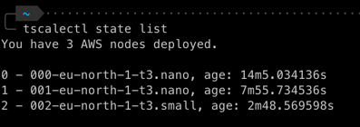

## tscalectl state dump
- Dump internal CLI state. 
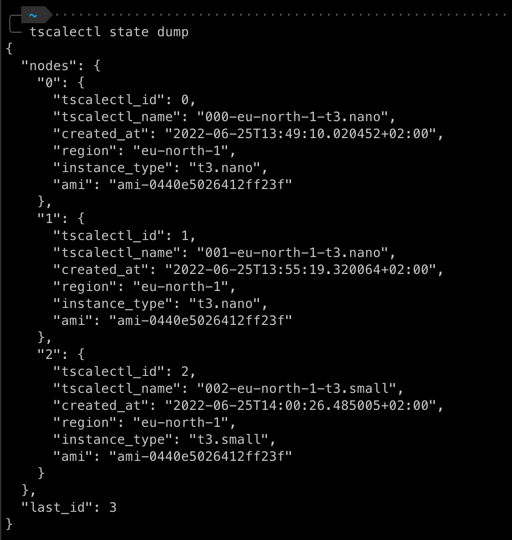

## tscalectl ssh [nodeID]
- Print SSH command which can be used to connect to EC2 instance. 
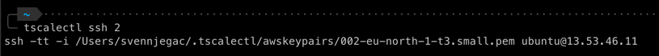

## tscalectl down [nodeID]
- Terminate EC2 instance, delete its security group and key pair. Remove node from internal CLI state. Delete local SSH keys for instance. 
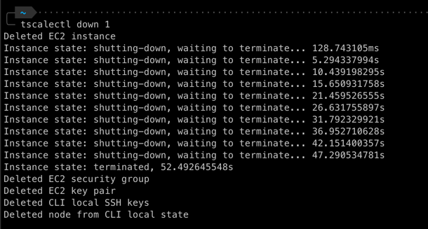
